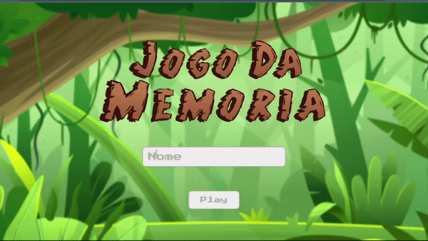

<h1 align="center"> 🌐 Jogo Da Memória!! </h1>

 

<h2 align="center"> 📽️Apresentação </h2>

  

## 🚀 Tecnologias

Esse projeto foi desenvolvido com as seguintes tecnologias:

- HTML e CSS
- JavaScript
- Git e Github
- Photoshop (Criação das imagens)

## 💻 Projeto

Desenvolvi esse projeto com o intuito de praticar HTML, CSS e JS. 
Aproveitando para exercitar conhecimentos básicos de design com a criação das imagens das cartas e da logo inicial. O jogo é bem fácil de se jogar, o objetivo é encontar cartas iguais e assim ir formando pares, assim que todos os pares forem encontrados o jogo termina.
 
## ⚡Link do projeto: 

https://jvsantos-jogo-memoria.netlify.app/index.html
